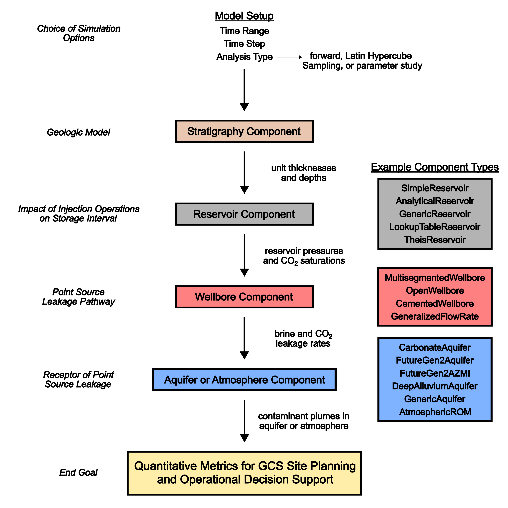
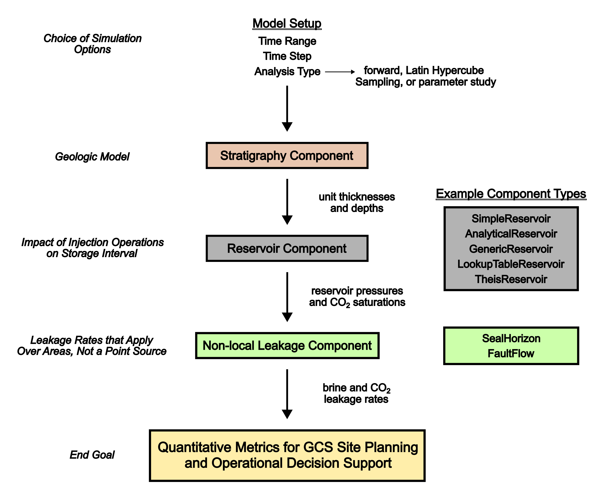
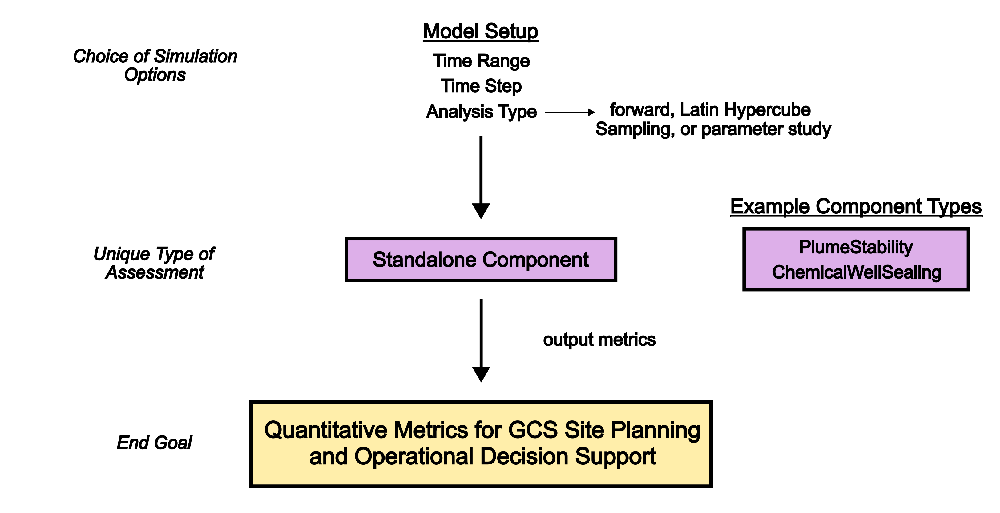

.. include:: ../../common/replace_math.rst

Conceptual model and overview
=============================

NRAP-Open-IAM is designed for modeling and simulating the behaviour of geologic
carbon storage (GCS) system models. These system models can include
representations of reservoir response to |CO2| injection, the resulting impacts
on potential leakage pathways like wellbores, and any contaminant plumes that
form in aquifers or the atmosphere due to brine or |CO2| leakage. Each
part of this process (reservoir response, leakage pathway behavior, and impacts
on the receptor of leakage) is represented by a particular component within
the system model. Additionally, NRAP-Open-IAM can automate specific types of
analysis, for example, determining the area of review for a GCS site. The intended
purpose of NRAP-Open-IAM is to provide quantitative metrics that aid in GCS
project planning, permitting, and operational decision support. NRAP-Open-IAM
can be run through the graphical use interface (GUI; section :ref:`gui_operation`),
the control file interface (section :ref:`control_file`), or a script-based
approach in Python.

System model design
-------------------

Within NRAP-Open-IAM, the system model contains components that are connected
to each other. For example, a reservoir component can provide pressures and |CO2|
saturations to a wellbore component. The wellbore component then uses these
inputs to calculate |CO2| and brine leakage rates to a specific aquifer.
In its turn an aquifer component can use these leakage rates to model the evolution
of pH and TDS plumes within the aquifer. An aquifer component is a receptor type of
component which can also be represented by an atmosphere component.
For example, a wellbore component can provide leakage rates to the atmosphere,
and an atmosphere component can then be used to model the evolution of
atmospheric contaminant plumes. :numref:`workflow_figure1` is a conceptual
model demonstrating the connection of reservoir components,
wellbore components, and a receptor (aquifer or atmosphere components).
Almost all NRAP-Open-IAM system models include a stratigraphy component.
A stratigraphy component can be used to define the thicknesses and depths
of the storage reservoir, aquifers, and aquitards in the model domain.
Many NRAP-Open-IAM components are designed to link with the stratigraphy
component in a way that automatically sets component parameters related
to the stratigraphy without additional user efforts.

.. _workflow_figure1:

   Standard System Model Design

The setup demonstrated in :numref:`workflow_figure1` is the most common
design of an NRAP-Open-IAM system model. Other designs not fitting
the illustrated scheme are possible as well. For example, some of the components
producing leakage rates are not designed to be linked to an aquifer component
that accepts leakage from a point source. The ``SealHorizon`` component
can use pressures and |CO2| saturations from a reservoir component
to model brine and |CO2| leakage rates through a fractured caprock overlying
the storage reservoir, but the predicted leakage rates occur over an area
of the caprock/reservoir interface. The aquifer components shown in
:numref:`workflow_figure1` are designed to receive leakage rates from a point
source, like a wellbore, and, therefore, are not appropriate to use with
rates that apply over an area or a linear element (e.g., faults in the
``FaultFlow`` component). Such components can still be used to evaluate
leakage risks, however, and :numref:`workflow_figure2` shows a conceptual model
demonstrating the connection of a reservoir component with a non-local leakage
pathway component (i.e., not a point source leakage pathway). Aquifer
components accepting leakage rates that apply over areas or linear elements may be
developed in the future. The system model shown in :numref:`workflow_figure2`
represents how these non-local leakage pathway components can be used
with the currently available aquifer components.

.. _workflow_figure2:

   Non-local Leakage System Model Design

NRAP-Open-IAM has several components that are designed to not be connected to other
components. For example, the ``PlumeStability`` component does not connect
to the stratigraphy or leakage pathway components. Instead, it uses .csv files
containing reservoir conditions over time to evaluate the development and
movement of plumes within the reservoir (e.g., plume areas, velocity of the
plume centroid, and the direction in which the dispersion of the plume occurs).
The ``ChemicalWellSealing`` component, which evaluates if and when a fracture
will seal due to calcite precipitation, also does not connect with
other components. This type of system model design is demonstrated
in :numref:`workflow_figure3`.

NRAP-Open-IAM is designed to accept a variety of component designs,
so it can be used to create many different system model designs. Note that
the same type of .csv files used by ``PlumeStability`` components can also be
used to read reservoir conditions into a system model with ``LookupTableReservoir``
components (e.g., driving wellbore leakage components with output
from high-fidelity reservoir simulations).

.. _workflow_figure3:

   Standalone Component System Model Design

The support of one GCS site may require the use of multiple system models.
For example, the ``ChemicalWellSealing`` component (:numref:`workflow_figure3`)
can help inform which wells are likely to self-seal and, therefore, might be
excluded from being considered as a possible leakage pathway
in a larger GCS system model (:numref:`workflow_figure1`).
The ``ChemicalWellSealing`` component has a parameter related to reservoir
pressure, so one should first constrain this parameter by running
a reservoir simulation (either through a separate program or through
an NRAP-Open-IAM simulation where the reservoir component is the final
component in the chain). In this case, one might use three GCS system
models (1) to constrain reservoir pressures, (2) to determine whether particular
wells will self-seal (:numref:`workflow_figure3`), and (3) to model the behavior
of the whole GCS site (excluding wells that will self-seal;
:numref:`workflow_figure1`).

Component parameters and applications
-------------------------------------

Each component model has a variety of parameters, and these parameters have
different limits or ranges. When setting up a simulation, any component parameter
that is not given a value by the user will automatically be set
to the parameter's default value.

Different components are meant to be used in different applications.
For example, the ``TheisReservoir`` component was designed to handle multiple
(brine) injection and/or extraction wells over a large area, with the pressures
produced reflecting the interaction of multiple wells. In contrast,
the ``SimpleReservoir`` component can simulate only one injection well.
The ``FutureGen2Aquifer`` and ``FutureGen2AZMI`` components were designed
to represent the specific geochemistry of the Future Gen site but may be
applicable to similar aquifers with depths between 100 m and 700 m
(``FutureGen2Aquifer``) and 700 m and 1600 m (``FutureGen2AZMI``).
The ``OpenWellbore`` component is useful for worst-case comparison scenarios
where leakage through an unplugged wellbore enters an aquifer. In contrast,
a ``MultisegmentedWellbore`` component simulates flow through impaired cement
and can account for leakage into multiple aquifers overlying the injection zone.
More details regarding the distinctions between different wellbore components
and their intended applications are available in chapter :ref:`components_comparison`.
Descriptions of NRAP-Open-IAM components and their parameters are
provided in chapter :ref:`components_description` below.

Analysis types
--------------

NRAP-Open-IAM simulations can use one of three analysis types: ``Forward``,
Latin Hypercube Sampling (``LHS``), or parameter study (``Parstudy``)
(:numref:`workflow_figure1` - :numref:`workflow_figure3`). A ``Forward``
analysis (``forward`` in the control file interface) is deterministic. Each
parameter is fixed at a certain value, so the simulation has the same results each
time it is run.

``LHS`` simulations (``lhs`` in the control file interface) are stochastic:
the parameters are varied between minimum and maximum values according to their
dsitribution. An ``LHS`` simulation consists of many separate realizations,
where each realization has different parameter values. This approach helps
to address parameter uncertainty. For example, by constraining parameter values
within reasonable (and random) bounds, one can focus on the proportion of ``LHS``
realizations in which leakage occurs. This proportion can be used to estimate
the likelihood of such a leakage event. Leakage occurring in 10% of realizations
could be considered to correspond to a 10% probability of leakage, given the user's
current understanding of the parameter values. Latin Hypercube Sampling
is different from a purely random approach in that it evenly samples
the range of values for each stochastic parameter, and runs the model
for different combinations of parameter values. A purely random sampling
of parameter values could fail to explore a large section of the parameter space.
``LHS`` simulations divide each parameter's range into subranges; within each
subrange, a parameter value is randomly selected. Because ``LHS`` simulations
need to evenly sample the parameter space through the assessment of
multiple subranges, each ``LHS`` simulation requires a minimum number of realizations.
If one attempts to run an ``LHS`` simulation without a sufficient number
of realizations, the code will raise a ``LinAlgError`` saying
"Matrix is not positive definite." If this error occurs, increase the total
number of realizations.

The ``Parstudy`` analysis type (``parstudy`` in the control file interface)
also evaluates different realizations of each simulation, where each realization
has different parameter values. The ``Parstudy`` analysis type also divides a
variable parameter's specified range into separate subranges and then selects
a value from each subrange. While an ``LHS`` simulation has the user to specify
how many realizations to evaluate, a ``Parstudy`` simulation has the user
to specify how many parameter values to use for each stochastic parameter
(i.e., number of subranges within the overall range). As a result, the number
of realizations for ``Parstudy`` simulations increases exponentially with the number of
stochastic parameters.

Overall, the ``Forward`` analysis type is intended to be used for decision-support
of GCS system models that are deterministic and conceptually appropriate.
The ``LHS`` analysis type is intended to be used for decision-support of GCS
system models that address the uncertainty in parameter values. Finally,
the ``Parstudy`` analysis type is intended to be used to study the effects
of certain parameters on model outputs (i.e., sensitivity analysis). Studying
the effects of certain parameters is important for decision support.
Understanding which parameters have the most significant impact can help
inform the user about the parameters they should focus on constraining
in their study area. Control file interface can help to automate sensitivity
analysis within ``LHS`` simulations; see *ControlFile_ex8a*-*ControlFile_ex8c*.

Visualization options
=====================

NRAP-Open-IAM includes a variety of visualization options. For example, there are
multiple options for plotting a model domain's stratigraphy with
2-dimensional and 3-dimensional plots. The 3-dimensional ``Stratigraphy`` plot
type can display features like injection sites and wellbores. The user can
specify spatial variations in unit thicknesses and depths, and the
stratigraphy visualization options are provided to help users ensure that
the model domain conforms to the intended design. Other plot types available
with NRAP-Open-IAM include: time series of outputs; map-view figures showing
the extent of reservoir and aquifers impacts (meant to inform an operation's
area of review (``AoR``)); map-view figures showing when monitoring wells
at specified locations can detect contaminant plumes in aquifers
(time to first detection, ``TTFD``); and map-view figures showing the extent
of atmospheric |CO2| plumes. The plotting options in NRAP-Open-IAM through the GUI
interface (section :ref:`gui_operation`) are somewhat limited. Control file
and script inteface have access to all visualization options in NRAP-Open-IAM
(see, e.g., section :ref:`cfi_visualization`). Simulation results are saved
in .csv files, however, and these files can be used to create figures in separate
programs.
