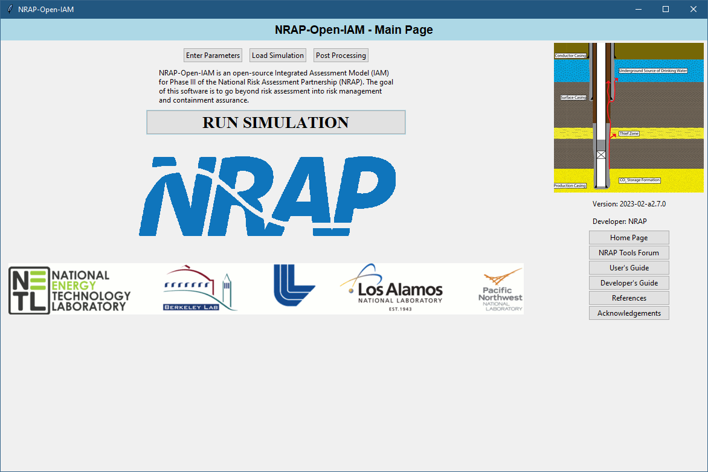
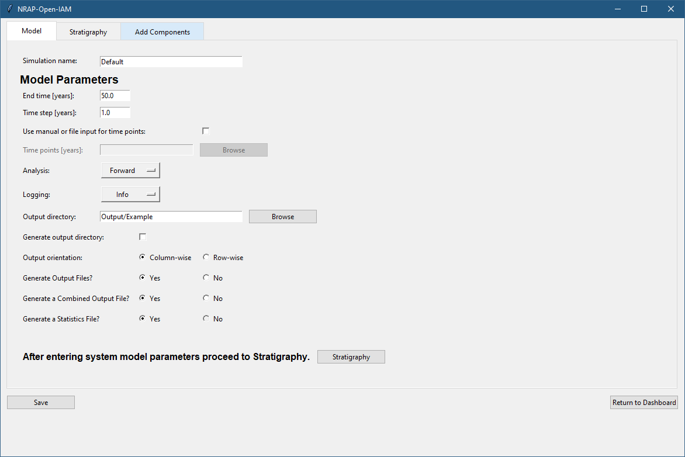
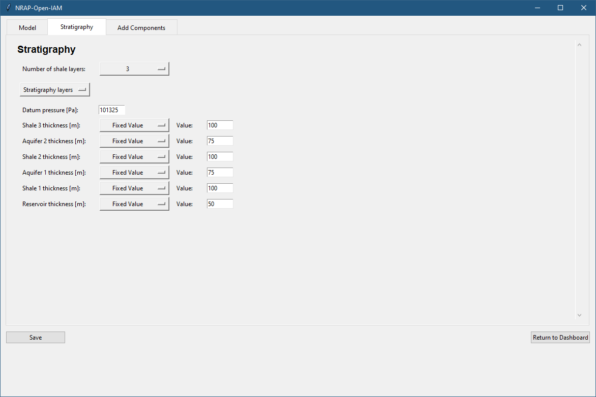
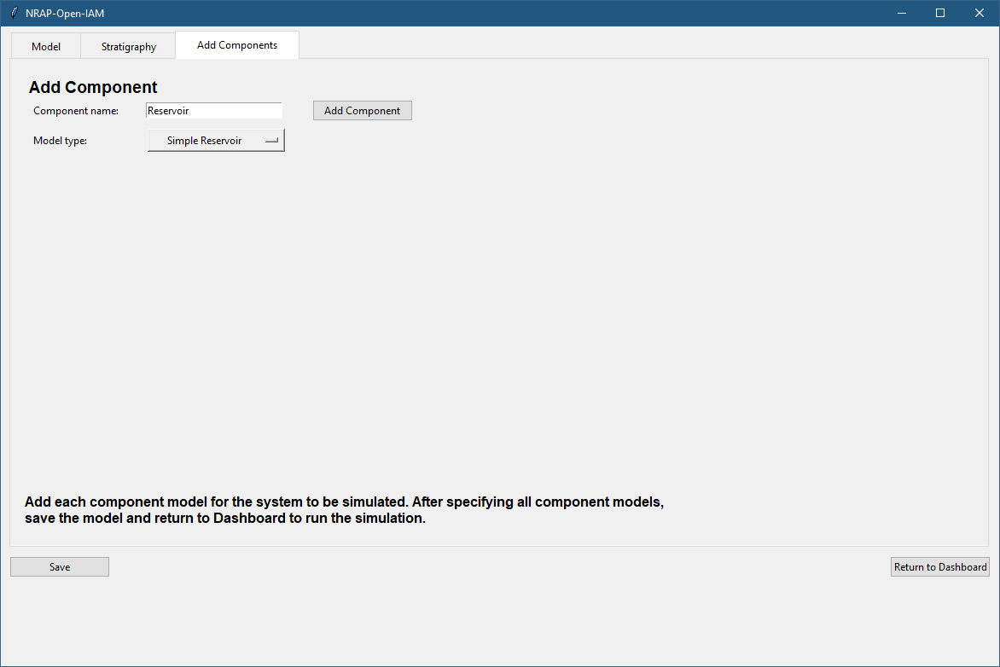
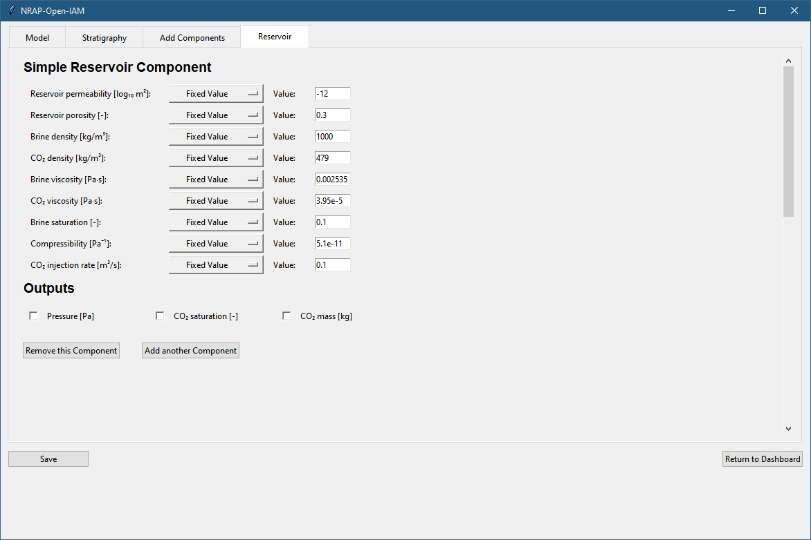
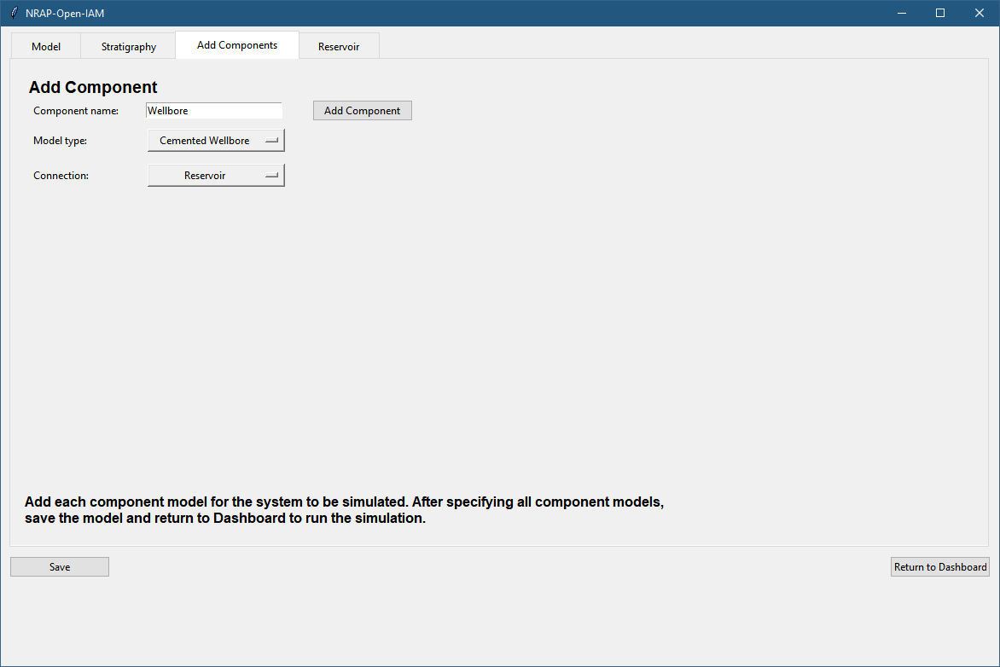
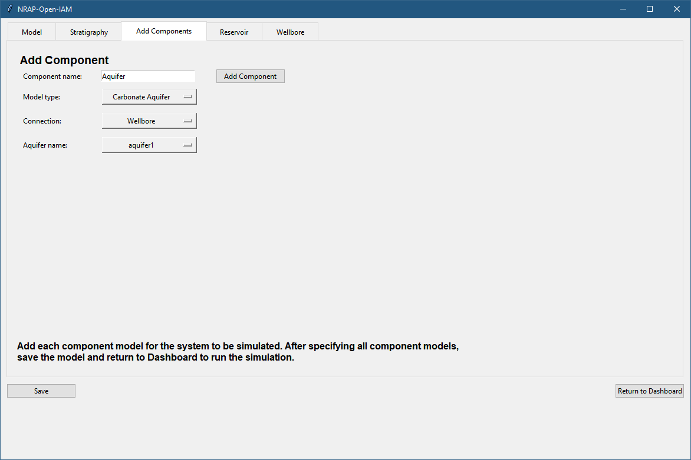

.. include:: conceptual_model_overview.rst

.. _gui_operation:

GUI Operation
=============

When the GUI is first opened a disclaimer screen will be shown followed
by the main interface.

   Main NRAP-Open-IAM Interface

To begin building a model click on the **Enter Parameters** button.
The process of building a model consists of entering basic model parameters,
defining the geologic stratigraphy of the site, then adding a component model
for each component of the system to be modeled. Therefore, the first tab that
user would see after clicking the **Enter Parameters** button is the model
parameters view.

   Model Parameters View

Start by defining a ``Simulation name`` for the model: the name also will be used as the
name of the file containing details of NRAP-Open-IAM simulation. Time should be entered in years.
The ``End time`` is the number of years during which the simulation will be run.
A uniform time step will be taken during the simulation specified by the ``Time step``
entry (typically 1 year time steps are used). The NRAP-Open-IAM can
perform three types of simulations and/or analysis: ``Forward``, ``LHS``, and ``Parstudy``.
``Forward`` analysis runs a single deterministic scenario. ``LHS`` (abbreviation for
Latin Hypercube Sampling) is the type of random parameters sampling used
to run stochastic simulations. ``Parstudy`` (short for parameter study analysis)
divides user-defined range for each stochastic variable into equally spaced
subdomains and selects parameter value from each subdomain. ``Parstudy`` analysis is useful
for studying the effects of several variables on the components outputs
but the number of realizations grows exponentially with the number of variables.

The NRAP-Open-IAM creates a log file with each simulation run: the level of information
being logged in can be set by changing value of ``Logging`` entry. In general, the
default level of ``Info`` would contain the most useful messages. A ``Debug``
(debugging) level of ``Logging`` will contain more information about component
model connections, setup and calls, but will produce very large files and should be
avoided for large simulations. ``Warn`` (warning) and ``Error`` levels
can be used if log file sizes become an issue.

..
  #TODO add detail.

The NRAP-Open-IAM will save all the simulation results to the specified ``Output directory``.
In text field corresponding to ``Output directory`` user needs to enter
a path to the folder where the output will be saved. In the case the entered path
does not exist the empty directory will be created
if box ``Generate output directory`` is checked. Additionally, if the provided
path is not absolute, it is assumed that it starts in the NRAP-Open-IAM root folder.
A ``{datetime}`` stamp can be added to the folder name so that each run of a particular
simulation will be saved separately, otherwise results from a previous run
will be overwritten by subsequent runs until the output folder is changed. After
setting up the model parameters proceed to the Stratigraphy tab.

   Stratigraphy View

In the Statigraphy tab model parameters related to the stratigraphy of the |CO2|
storage site are defined. All coordinate systems are assumed to have units of meters and
are defined by the reservoir component used. Model parameters for the stratigraphy
and appropriate components are defined by either assigning a fixed value
or random distribution to vary over. For the LHS analysis parameters defined
with a distribution will be sampled from that distribution. For forward
simulation all parameters should be specified with a fixed value.
See the :ref:`stratigraphy_component` section of this
document for a list of all available parameters and their definitions.

Adding Component Models
-----------------------

The NRAP-Open-IAM is designed in a way so that only the components of interest
need to be modeled in the system. Generally, a simulation will be built
from the deepest component upward (reservoir, wellbore, aquifer, etc.).
To add a component, first give it a name (each component must have a unique name).
Next select the type of component model to be used.
When adding subsequent components, a connection to existing components can be specified.

   Adding a Component Model

Each component model has component-specific input parameters and outputs.
Parameters can be specified to be sampled from different distributions, or
take on default values. When running a forward model parameters should only be
specified as fixed values. When running a parameter study the parameters
to vary should be specified as having a uniform distribution and minimum and
maximum values. For stochastic simulations, any distributions can be specified.
Parameter and output definitions can be found in the specific component model
parameter section.

   Setup of Reservoir Component

If a component is specified that needs input from another component but the deeper component
is not to be part of the model (i.e. specifying a wellbore model without a reservoir model),
dynamic parameters can be used for the component model input. For dynamic parameters a value
must be specified for each time step in the simulation. Values can be entered
manually separated by a comma, or entered by providing path to the file
containing the data.
Some components require specification of which layer in the stratigraphy they
represent (such as an aquifer model).

   Adding Second Component

   Adding a Component Model with Connection and a Stratigraphy Selection

After a given component is specified, subsequent component can be added to the
system model. When all required components have been added, save the model and
return to the dashboard. The system model can then be run using
the **RUN SIMULATION** button on the main dashboard.

GUI Setup Examples
------------------

In the folder *examples*, there is a subfolder *GUI_Files* with example simulation
files that can be loaded into the GUI and run by the NRAP-Open-IAM. To run one
of the provided examples select **Load Simulation** on the main dashboard of the GUI.
In the file browser that appears, navigate to the *GUI_Files* subfolder of the
*examples* folder and select the first example file *01_Forward_AR_CW.OpenIAM*.
This example runs a simple forward model with a ``AnalyticalReservoir`` component
providing an input to a ``CementedWellbore`` component.
When the file is loaded into the GUI, the parameters of the simulation
can be investigated. After the simulation is complete the user can proceed to the
post-processing step (by clicking **Post Processing** on the main dashboard of the GUI)
to visualize and, for some scenarios, analyze the obtained results. Post Processing
tab has a folder selection button which allows user to select (output) folder
containing results of simulation. Note that the selection of the folder
(and loading of results) might fail if the simulation did not finish successfully.
In this case it is recommended to check file *IAM_log.txt* within the output folder
containing useful (debug, info, warning or error) messages produced during the simulation.
File names of the GUI setup examples distributed with the tool contain shortcuts
that would help the user to figure out the featured components and type of analysis.

The second example file *02_LHS_AR_MSW.OpenIAM* is a stochastic simulation of
system model containing a ``AnalyticalReservoir`` and a ``MultisegmentedWellbore``
components. Example illustrates Latin hypercube sampling approach applied to the
parameters of the setup model. The number of realizations run is 30.

The third example file *03_LHS_LUT_MSW.OpenIAM* illustrates use of a
``LookupTableReservoir`` and ``MultisegmentedWellbore`` components. The lookup tables data
set utilized in the example for the ``LookupTableReservoir`` component is based
on the simulation for Kimberlina oil field (:cite:`DAA2018`).

The fourth example file *04_LHS_DP_MSW.OpenIAM* illustrates Latin hypercube
sampling approach applied to a ``MultisegmentedWellbore`` component. The pressure
and |CO2| saturation required as inputs of the component are provided in the
form of arrays. This form of input arguments is called dynamic parameters,
i.e. parameters that change in time.

The system model setup in the fifth example file *05_LHS_AR_OW_CA.OpenIAM*
illustrates application of three component models: ``AnalyticalReservoir``, ``OpenWellbore``
and ``CarbonateAquifer``. It estimates the impact the leakage of fluids through
the wellbore has on the aquifer overlying the storage reservoir.
