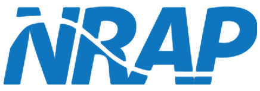

***********************
Obtaining NRAP-Open-IAM
***********************

.. toctree::

Introduction
============
NRAP-Open-IAM is an open-source Integrated Assessment Model (IAM) for
Phases II and III of the National Risk Assessment Partnership (NRAP). The goal
of this software is to go beyond risk assessment into risk management and
containment assurance. NRAP-Open-IAM is currently in active development and
is available for testing and feedback only.

As this is a prototype of software being actively developed, we
are seeking any feedback and/or issue reports. An online feedback form
can be found here:
https://docs.google.com/forms/d/e/1FAIpQLSed5mcX0OBx1dLNmYGbmS4Vfc0mdOLapIzFqw-6vHoho9B19A/viewform?usp=sf_link

Issue reports and feedback can be left at the forum on NETL's
Energy Data eXchange webpage for NRAP-Open-IAM:
https://edx.netl.doe.gov/workspace/forum/nrap-tools/topic?t=nrap-tools-nrap-open-iam
or on GitLab issues page for NRAP-Open-IAM:
https://gitlab.com/NRAP/OpenIAM/-/issues?sort=created_date&state=opened

If you have been given access to the code indirectly and would like to be
notified when updates are available for testing, please contact the development team
to be added to our email list.

Downloading NRAP-Open-IAM
=========================

NRAP-Open-IAM tool and examples can be downloaded from a public GitLab
repository located at https://gitlab.com/NRAP/OpenIAM. If the NRAP-Open-IAM
was downloaded from the GitLab repository, the folder name may have
the repository's current hash appended to it. Feel free to rename the folder
something simple like *NRAPOpenIAM* to simplify the navigation.

..
    In addition to that,
    the copy of the tool can be obtained through NETL's Energy Data eXchange
    website: https://edx.netl.doe.gov/dataset/nrap-open-source-iam
    by requesting an access through e-mail addressed to NRAP@netl.doe.gov.
    The NRAP-Open-IAM is distributed as a zip file that can be extracted in the location
    specified by user.

Installing NRAP-Open-IAM
========================

The NRAP-Open-IAM requires Python version 3.9 or greater to operate.
If you need to install Python, we describe all steps of the installation
process below.

General Installation Guide:
 - Extract the tool files from the provided/downloaded zip.
 - Navigate to the *installers* folder within the recently unzipped directory.
 - Navigate to the folder corresponding to the operating system that you are utilizing.
 - Follow instructions file located in the folder for your operating system.

For Windows: The file *Installation_Instructions_Windows.txt* describes
steps required to install needed Python packages for the proper work of
NRAP-Open-IAM.

For macOS: The file *Installation_Instructions_macOS.txt* describes
steps user needs to follow in order to install required Python packages.

For Linux OS: Linux users are assumed to know the installation commands
for their specific version of Linux needed to install required tools.
The file *Installation_Instructions_Linux.txt* specifies the needed software
and package dependencies.

For alternative installation of Python the following packages are needed:
``NumPy``, ``SciPy``, ``PyYAML``, ``Matplotlib``, ``Pandas``,
``TensorFlow`` (of version 2.6), ``Keras``, ``scikit-learn``,
``Pmw``, ``pip``, and ``six``. In most cases (mainly dependent
on the platform and Python distribition) the required libraries can be
installed using ``pip`` or ``conda`` package managers. Additional libraries
recommended to run Jupyter notebooks and scripts illustrating work of NRAP-Open-IAM are
``IPython`` and ``Jupyter``.

On macOS and Linux machines the gfortran compiler needs to be present/installed
to compile some of the NRAP-Open-IAM code (macOS users can find gfortran here:
`(https://gcc.gnu.org/wiki/GFortranBinariesMacOS)
<https://gcc.gnu.org/wiki/GFortranBinariesMacOS>`_).

After the proper version of Python is installed, the NRAP-Open-IAM can be set up and tested.
**Note: If Python was installed through Anaconda please use Anaconda prompt instead
of command prompt for setup and tests.**
In the NRAP-Open-IAM distribution folder find and open the sub-folder *setup*.
Next, open a command prompt/Anaconda prompt in the *setup* folder (on Windows,
this can be done by holding Shift and right clicking inside the folder when
no file is selected, then selecting ``Open command window here``; alternatively,
one can navigate to the folder *setup*, type ``cmd`` in the address bar of the
file browser and hit Enter to open the command prompt there). (On Windows,
Anaconda prompt can be found in the programs menu under submenu
``Anaconda3 (64-bit)``.) Run the setup script by entering the command::

    python openiam_setup_tests.py

in the command prompt/Anaconda prompt. This will test the version of Python installed on the system.
Next the setup script will test the versions of several Python libraries
that the NRAP-Open-IAM depends on. The setup script will compile several
Fortran libraries needed for some component models on Mac and Linux.
Users of Windows OS will be provided with the compiled libraries.
Finally, the setup script will run the test suite to see if the NRAP-Open-IAM
has been installed correctly. If the results printed to the console indicate
errors during the testing the errors have to be resolved before the NRAP-Open-IAM can be used.
When contacting the developers to resolve problems please include all output
from the setup script or test suite runs.

Testing installation
====================

After setup the test suite can be run again by entering the NRAP-Open-IAM *test*
directory in a terminal and typing::

    python iam_test.py

Test results will be printed to the terminal. The setup script run during
the installation process uses the same test suite after testing whether the necessary
Python libraries are installed, and compiling the NRAP-Open-IAM libraries.

Contributors
============

During the Phase II and/or Phase III of the NRAP the following researchers contributed
to the development of NRAP-Open-IAM (listed in alphabetical order with affiliation
at the time of active contribution):

* Diana Bacon (Pacific Northwest National Laboratory)
* Seunghwan Baek (Pacific Northwest National Laboratory)
* Pramod Bhuvankar (Lawrence Berkeley National Laboratory)
* Suzanne (Michelle) Bourret (Los Alamos National Laboratory)
* Julia De Toledo Camargo (Pacific Northwest National Laboratory)
* Bailian Chen (Los Alamos National Laboratory)
* Abdullah Cihan (Lawrence Berkeley National Laboratory)
* Dylan Harp (Los Alamos National Laboratory)
* Paul Holcomb (National Energy Technology Laboratory)
* Jaisree Iyer (Lawrence Livermore National Laboratory)
* Elizabeth Keating (Los Alamos National Laboratory)
* Seth King (National Energy Technology Laboratory)
* Greg Lackey (National Energy Technology Laboratory)
* Ernest Lindner (National Energy Technology Laboratory)
* Kayyum Mansoor (Lawrence Livermore National Laboratory)
* Mohamed Mehana (Los Alamos National Laboratory)
* Saro Meguerdijian (Los Alamos National Laboratory)
* Nathaniel Mitchell (National Energy Technology Laboratory)
* Omotayo Omosebi (Lawrence Berkeley National Laboratory)
* Veronika Vasylkivska (National Energy Technology Laboratory)
* Ya-Mei Yang (National Energy Technology Laboratory)
* Yingqi Zhang (Lawrence Berkeley National Laboratory)
